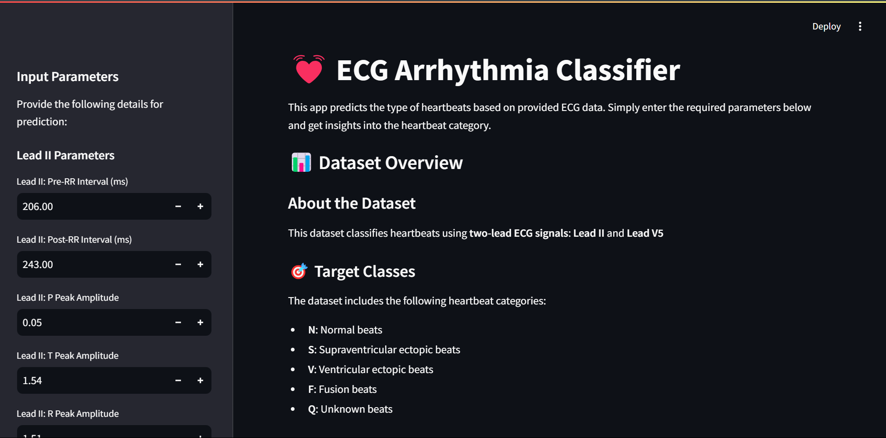

# ECG-Arrhythmia-Classifier

### Classifying Arrhythmias from ECG Signals ❤️📈

Hey there! 👋 Welcome to my machine learning project, where I'm working on classifying arrhythmias using ECG signals. This project explores how artificial intelligence can assist in detecting and classifying cardiac conditions with precision.

The entire pipeline is designed to be reproducible and scalable, so you can easily follow along and replicate the results on your machine or in the cloud.✨ I’ve used a dataset containing ECG signal data and built an end-to-end machine learning solution using tools like Streamlit, Flask, Docker etc

The goal? Help healthcare professionals detect and classify arrhythmias more accurately, improving patient care with the power of AI.

## 📝 **Problem Description**

Arrhythmias are irregular heartbeats that can be harmless or life-threatening, depending on their type. Early detection is critical for effective patient management and better health outcomes.

### **Objective**

This project aims to develop a machine learning model that classifies arrhythmias based on ECG signal features.

### 📊 **Dataset**

This project uses an ECG dataset from Kaggle, which is based on the **MIT-BIH Arrhythmia Dataset** from PhysioNet. The dataset contains essential features derived from two-lead ECG signals(lead II and lead V5), which are used to train the arrhythmia classification model.

- **Number of records**: 460846
- **Number of features**: 33

For more detailed information about the dataset, including explanations of the columns, please refer to the [data folder](./data/README.md).

Ready to see how AI can help detect arrhythmias and save lives? Let’s get started! ✨

## 🎉 Live Streamlit App

You can check out the live version of the Streamlit app at the following URL:

[Streamlit App](https://heart-class.streamlit.app/)

### 📸 Screenshot of the App



## 🔧 Tools & Techniques

To bring this project to life, I used:

- **Containerization:** Docker and Docker Compose
- **Web Application Framework (Local Deployment):** Flask (for local web deployment)
- **Web Application Framework (Cloud Deployment):** Streamlit (for cloud-based web deployment)

## ✨ Setup

### **Local Setup**

#### **Clone the Repository**:

```bash
git clone https://github.com/Tobai24/ECG-Arrhythmia-Classifier.git
cd ECG-Arrhythmia-Classifier
```

#### **Set Up the Python Environment**:

**Option 1: Using `pipenv`** (Recommended)

- Install Pipenv using your system's package manager (preferred for Debian-based systems):

  ```bash
  sudo apt install pipenv
  ```

  Alternatively, you can install Pipenv via `pip`:

  ```bash
  pip install pipenv
  ```

- Install the dependencies with `pipenv`:

  ```bash
  pipenv install
  ```

- Activate the `pipenv` shell:
  ```bash
  pipenv shell
  ```

**Option 2: Using `requirements.txt`** (For users preferring `pip`)

- Create and activate a virtual environment:

  ```bash
  python -m venv venv
  source venv/bin/activate  # On Windows use: venv\Scripts\activate
  ```

- Install the dependencies:
  ```bash
  pip install -r requirements.txt
  ```

---

### 📝 Notes:

- If you use `pipenv`, you do not need to install the `requirements.txt` dependencies manually because `pipenv` reads the `Pipfile` and manages the environment for you.
- For Debian-based systems, using `sudo apt install pipenv` ensures compatibility with the system Python environment and avoids issues with the "externally managed environment" restriction.

## Exploratory Data Analysis and Modeling

The exploratory data analysis and modeling are done in the [notebooks directory](notebooks/). The exploratory data analysis and model building are done in the `notebook.ipynb` notebook.

The notebook directory also contains the model called `model.pkl`, where the model from the `notebook.ipynb` is stored.

It also contains the training script (which contains the script for training the model with the best AUC) which you can run by running `python train.py` in the terminal

```bash
python train.py
```

## Get Going

Ready to dive into your project? Here’s a quick guide to get you started.

### 📁 **Deployment**

### **Local Deployment**

- **Tools Used**: Flask for building your web app and Docker for containerizing it.
- **Where to Find It**: Head over to the [deployment/local_deployment](deployment/local_deployment) folder.

The README in that folder covers everything you need to get your app running locally.

It’s got the details for setting up Flask and Docker, so you can test things out on your own machine.

### **Cloud Deployment**

- **Tools Used**: Streamlit community cloud for hosting your app and Streamlit for the web interface.
- **Where to Find It**: Navigate to the [deployment/web_deployment](deployment/web_deployment) folder.

The README in that folder guides you through deploying your app using Streamlit. It’s perfect for getting your app live on the cloud.

## 🎉 Special Mentions

A huge thank you to [DataTalks.Club](https://datatalks.club) for offering their ML course for free! 🌟 The insights and skills I gained from their course were crucial in developing this project.

If you want to enhance your expertise in machine learning, I highly recommend checking out their [course](https://github.com/DataTalksClub/machine-learning-zoomcamp). It’s an invaluable resource for diving into machine learning! 📚✨
