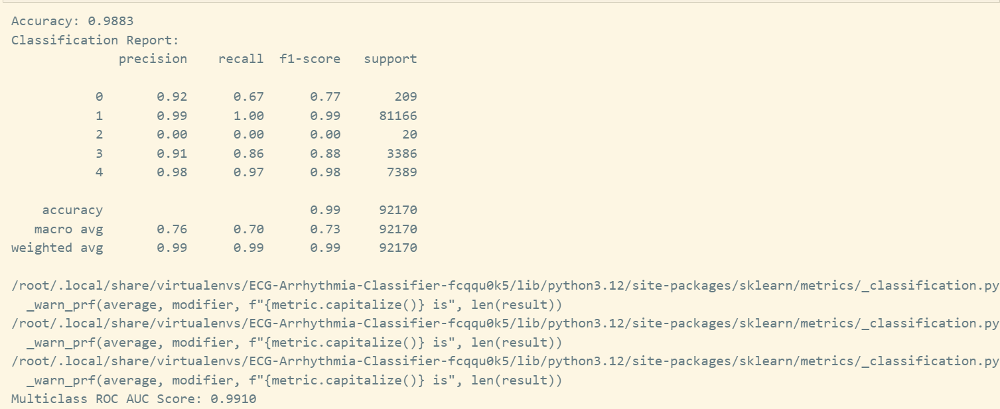

## The models trained are:

- LogisticRegression model
- RandomForestClassifier
- XGBClassifier

The XGBClassifier has the best AUC score of 0.9910 on all the training dataset with the following hyperparameter:

```python
xgb_model = xgb.XGBClassifier(
    objective='multi:softprob',
    num_class=5,
    max_depth=10,
    learning_rate=0.2,
    n_estimators=200,
    colsample_bytree= 0.8,
    subsample= 1.0,
    random_state=42
)
```



You can also check the notebook.ipynb file to see the preprocessing done on the model to achieve this score.
